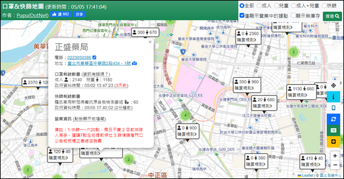

# [已停止運作] 快篩、公費快篩、社區採檢站即時販售庫存資訊地圖

> [!IMPORTANT]
> **本專案已停止運作及維護 (Archive Notice)**
> 
> 由於疫情趨緩及政府相關資料介接方式變更（如庫存 API 停止更新），本專案已於 **2022 年底** 正式停止維護。
> 
> 目前網站功能僅供程式碼參考、研究 Leaflet.js 地圖實作與資料處理邏輯之用，實際庫存資訊已不再準確，請勿將其作為醫療決策參考。

[](https://opensource.org/licenses/MIT)


本專案是一個基於 OpenStreetMap 與政府開放資料開發的即時地圖工具，旨在提供民眾快速查詢「快篩試劑剩餘庫存」、「公費快篩發放點」以及「社區採檢站」的即時位置與狀態。

## 🖼️ 專案截圖



## 🌟 核心功能

- **即時庫存查詢**：自動抓取並顯示全台藥局及衛生所的快篩試劑剩餘數量。
- **據點篩選器**：可切換顯示「快篩販售點」、「社區採檢站」或「公費快篩發放點」。
- **營業狀態過濾**：自動判斷當前時間，僅顯示營業中的據點，避免白跑一趟。
- **視覺化分級**：透過不同的圖示顏色（紅、黃、綠）區分庫存水位及最後異動時間。
- **自動定位**：支援 GPS 定位，開啟網頁後自動跳轉至使用者鄰近區域。
- **響應式設計**：支援手機與桌面瀏覽器，方便外出時即時查詢。

## 🛠️ 技術棧

- **地圖引擎**：[Leaflet.js](https://leafletjs.com/)
- **圖資來源**：國土測繪中心 (NLSC) WMTS、OpenStreetMap
- **前端框架**：Bootstrap 5, jQuery
- **地圖套件**：Leaflet.markercluster (處理大量標記)
- **資料格式**：CSV (由後端定時抓取政府 Open Data 生成)

## 📂 專案結構

- `index.html`: 主要進入點。
- `js/omap_origin.js`: 核心地圖與資料處理邏輯。
- `js/pharmacy_auto.js`: 預載的藥局/據點靜態資訊。
- `data/maskdata_auto.csv`: 歷史庫存資料。
- `css/style.css`: 介面樣式自定義。

## 🚀 本地開發 (僅供參考)

由於本專案主要為靜態網頁，您可以直接使用任何靜態伺服器開啟：

```bash
# 使用 Python
python -m http.server 8000

# 或使用 Node.js (serve)
npx serve .
```

開啟瀏覽器並造訪 `http://localhost:8000` 即可看到地圖。

## 📊 資料來源

本專案歷史資料曾介接自：
- 衛生福利部中央健康保險署 - [口罩/快篩試劑實名制庫存資料](https://data.nhi.gov.tw/)
- 衛生福利部疾病管制署 - [社區採檢院所與公費快篩發放清單](https://www.cdc.gov.tw/)

## 📄 開源授權

本專案採用 [MIT License](LICENSE) 授權。
